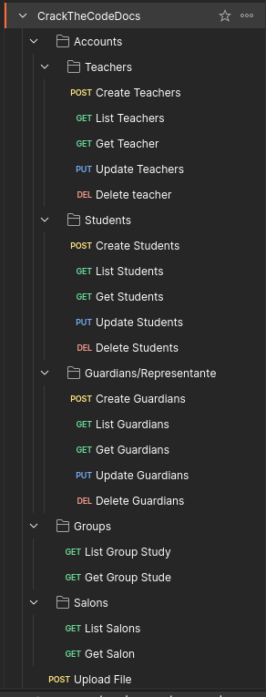

# Crack the code
> ESPAÑOL

**AL FINAL DE ESTE DOCUMENTO DEJE NOTAS IMPORTANTES**

Puede encontrar todo lo que necesita para iniciar el proyecto en este pequeño README. También encontrara un colección de POSTMAN para que se pueda probar los endpoint.

```
Colección: docs/CrackTheCodeDocs.postman_collection.json
```
Endpoints Disponibles:



## Python Version
`>3.10`

## Docker | Run server
> You had to have installed  `docker` and `docker-compose`
>
> Docker: https://docs.docker.com/engine/install/ubuntu/
>
> Docker-compose: https://docs.docker.com/compose/install/

**Run the command**

If you need to deploy through Docker I did development a script in bash for make this easier

### Start Project

```
./crack_code.sh runserver
```

> This command has works with permission to execute.  If this command does not work, please execute: `chmod +x crack_code.sh`

This command `build`, `migrations`, `load` and will run the `server`, if you want to development in docker environment


**Comment:**

Sometimes you need to run the command with `sudo` in that way you have to run the follows command:

```
> ./crack_code.sh help

crack_code.sh commands:
  runserver: run the development stack"
  migrate: run migrate to DB"
  run: Just run de server"
  load_data: load data
  exec: run a command inside a running container
  manage.py: run a manage.py command"
```


## Virtual Environment | Development
> You had to have installed `virtualenv` and `pip`

**1- Initial your virtualenv**

`virtualenv <path> --python=python3.10`

**2- Active your virtualenv**

`source <path>/bin/activate`

**3- Install Dependency**

`pip install -r requirements/base.txt`


**5- load User Admin and Group Users**

`python manage.py loaddata fixtures/user_admin.json`


`python manage.py loaddata fixtures/group_users.json`
___


## User Admin Default

You have to use the following credentials

| user                      | password        |
|---------------------------|-----------------|
| crackthecode@example.com  | crackthecode123 |

___

## Install this if you need to development
> Before you has to install Virtual Enviroment

### 1- How to set up dev tools
* install dev requirements  `pip install -r requirements/dev.txt`
* run  `pre-commit install`

### 2- How to set up linters tools
* install linters requirements  `pip install -r requirements/linters.txt`

### 3- How to run linters?
There are 3 types of linters:

* **Black:** Which formats the python code to black style: `black apps/`

* **Flake8:** which analyze code: `flake8 apps/`

* **Isort:** isort your imports, so you don't have to: `isort apps/ --profile black`

### 4- You can also run all linters as follows:

* `pre-commit run --all-files`

Details before run
```
Check Yaml...............................................................Passed
Fix End of Files.........................................................Passed
Trim Trailing Whitespace.................................................Passed
black....................................................................Passed
flake8...................................................................Passed
isort....................................................................Passed
```

## NOTAS

El proyecto tiene comentarios en todo el código, hay cosas que se hicieron de esa manera por temas de tiempo, pero seguramente se pueden mejorar. Como cargar el archivo es una de ellas, una carga masiva pueden ser miles de registros, tengo experiencia subiendo archivo de 1 millón de lineas, esto es mi portante que se maneje con tareas en según plano, se pueden aplicar muchas tecnologías, lambdas con SQS o SNS, Event Drive (RabbitMQ, Kafka), Celery o cualquier otro que se necesite.

Otra de las cosas que no me gusto mucho fue la autentificación de los endpoint son sencillos, creo que se debe trabajar mas en eso.

El proyecto se empaqueto todos sus módulos, se aplico SOLID y abstracción.
